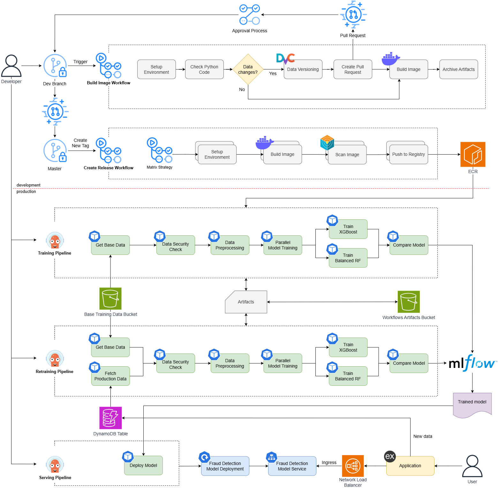

# MLSecOps

MLSecOps implementation for bank account fraud detection.



The repository combines:

- Model development for imbalanced fraud detection (XGBoost and Balanced Random Forest)
- Security checks for label-flipping data poisoning risks
- End-to-end workflow orchestration on Kubernetes (training, deployment, retraining)
- Experiment tracking and model lifecycle management via MLflow

## Related Repositories

- Infrastructure (IaC): [tramcandoit/mlsecops-iac](https://github.com/tramcandoit/mlsecops-iac)
- Helm charts: [quocanuit/mlsecops-charts](https://github.com/quocanuit/mlsecops-charts)

## Repository Layout

- `src/`: data processing, model training, security check, deployment scripts
- `scripts/`: environment setup and workflow trigger scripts
- `tools/workflows/`: Argo Workflow pipelines and reusable templates
- `tools/ci/`: Dockerfiles and build-time requirements for pipeline components
- `tools/k8s/`: Kubernetes manifests for model serving
- `docs/`: operational documentation (for example, service access)
- `main.tex`: paper source

## End-to-End Workflow

The MLSecOps flow in this repo is:

1. Prepare cluster access and credentials
2. Apply Argo workflow templates
3. Run training pipeline
4. Run serving deployment pipeline
5. Run retraining pipeline with production replay data

Core workflow files:

- `tools/workflows/training-pipeline.yaml`
- `tools/workflows/serving-deployment-pipeline.yaml`
- `tools/workflows/retraining-pipeline.yaml`

## Prerequisites

Install and configure the following tools:

- AWS CLI
- kubectl
- argo CLI
- yq
- jq

You also need:

- Access to the target AWS account and EKS cluster
- Permissions to assume the `GithubActions` IAM role (used by `scripts/setup.sh`)

## Configuration

Pipeline runtime parameters are read from:

- `scripts/cd-config.yaml`

Update this file before running workflows, especially:

- `imageTag`
- `ecrRegistry`
- `mlflowTrackingUrl`
- `s3ArtifactBucket`
- Retraining settings (`dynamodbTable`, `s3ProductionBucket`, `maxItems`, `replayRatio`)
- Serving setting (`modelVersion`)

## Quick Start

```bash
aws configure

# Prepare AWS role session and EKS kubeconfig
source scripts/setup.sh

# Register/update workflow templates
./scripts/trigger-workflows.sh --apply-templates

# Submit initial model training workflow
./scripts/trigger-workflows.sh --training-pipeline

# Deploy selected model for serving
./scripts/trigger-workflows.sh --serving-deployment

# Submit retraining workflow (with production replay data)
./scripts/trigger-workflows.sh --retraining-pipeline
```

## Workflow Commands

`scripts/trigger-workflows.sh` supports:

- `--apply-templates`
- `--training-pipeline`
- `--serving-deployment`
- `--retraining-pipeline`

The script validates required CLIs, checks cluster connectivity, loads config values from `scripts/cd-config.yaml`, and submits Argo workflows to namespace `argo-workflows`.

## Local Python Environment (Optional)

For local development of scripts in `src/`:

```bash
python -m venv .venv
source .venv/bin/activate
pip install -r requirements.txt
```

## Notes

- Service access instructions are in `docs/service-access.md`.
- This repository is focused on pipeline automation and reproducible MLSecOps experimentation for fraud detection workloads.
